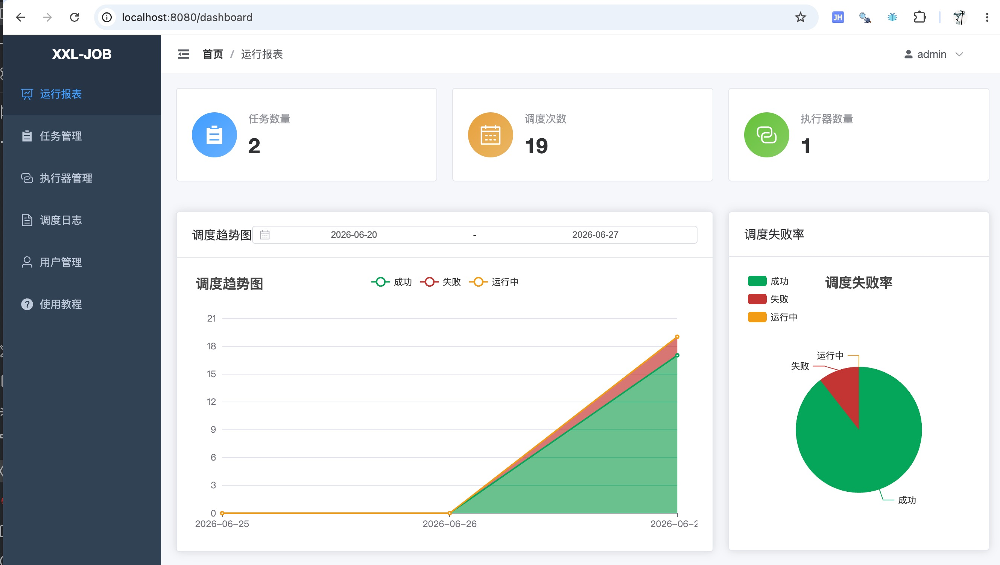
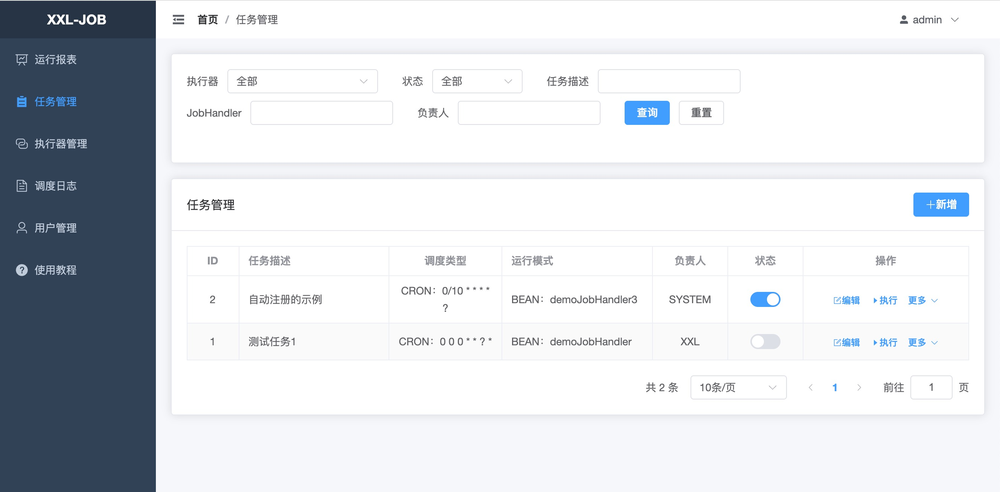
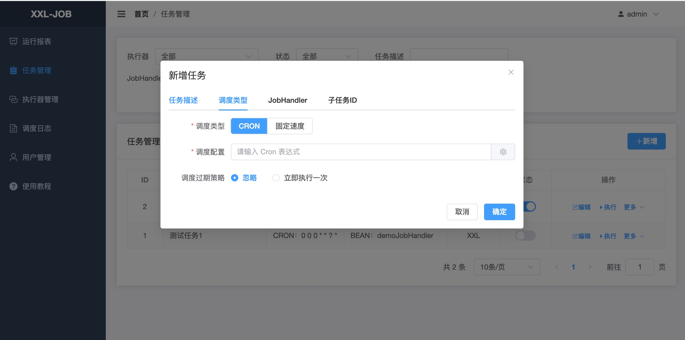
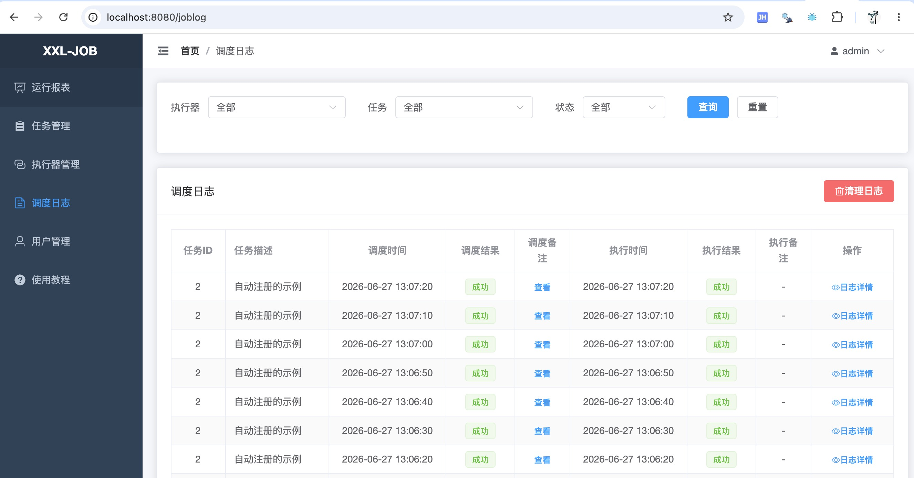

# xxl-job-lite

XXL-JOB-Lite — 基于 XXL-Job 2.5.0 深度重构的分布式任务调度框架，聚焦调度核心能力，剔除冗余扩展，保持轻量、稳定与原生使用习惯。

原项目：[xuxueli/xxl-job](https://github.com/xuxueli/xxl-job)

English version: [README.en.md](./README.en.md)

[](https://github.com/wuwen5/xxl-job-lite/actions/workflows/ci.yml)
[](https://sonarcloud.io/summary/new_code?id=wuwen5_xxl-job-lite)
[](https://sonarcloud.io/summary/new_code?id=wuwen5_xxl-job-lite)


[](https://central.sonatype.com/artifact/io.github.wuwen5.xxl-job/xxl-job-core)
[](https://github.com/wuwen5/xxl-job-lite/releases)
[](http://www.gnu.org/licenses/gpl-3.0.html)
[![zread](https://img.shields.io/badge/Ask_Zread-_.svg?style=flat&color=00b0aa&labelColor=000000&logo=data%3Aimage%2Fsvg%2Bxml%3Bbase64%2CPHN2ZyB3aWR0aD0iMTYiIGhlaWdodD0iMTYiIHZpZXdCb3g9IjAgMCAxNiAxNiIgZmlsbD0ibm9uZSIgeG1sbnM9Imh0dHA6Ly93d3cudzMub3JnLzIwMDAvc3ZnIj4KPHBhdGggZD0iTTQuOTYxNTYgMS42MDAxSDIuMjQxNTZDMS44ODgxIDEuNjAwMSAxLjYwMTU2IDEuODg2NjQgMS42MDE1NiAyLjI0MDFWNC45NjAxQzEuNjAxNTYgNS4zMTM1NiAxLjg4ODEgNS42MDAxIDIuMjQxNTYgNS42MDAxSDQuOTYxNTZDNS4zMTUwMiA1LjYwMDEgNS42MDE1NiA1LjMxMzU2IDUuNjAxNTYgNC45NjAxVjIuMjQwMUM1LjYwMTU2IDEuODg2NjQgNS4zMTUwMiAxLjYwMDEgNC45NjE1NiAxLjYwMDFaIiBmaWxsPSIjZmZmIi8%2BCjxwYXRoIGQ9Ik00Ljk2MTU2IDEwLjM5OTlIMi4yNDE1NkMxLjg4ODEgMTAuMzk5OSAxLjYwMTU2IDEwLjY4NjQgMS42MDE1NiAxMS4wMzk5VjEzLjc1OTlDMS42MDE1NiAxNC4xMTM0IDEuODg4MSAxNC4zOTk5IDIuMjQxNTYgMTQuMzk5OUg0Ljk2MTU2QzUuMzE1MDIgMTQuMzk5OSA1LjYwMTU2IDE0LjExMzQgNS42MDE1NiAxMy43NTk5VjExLjAzOTlDNS42MDE1NiAxMC42ODY0IDUuMzE1MDIgMTAuMzk5OSA0Ljk2MTU2IDEwLjM5OTlaIiBmaWxsPSIjZmZmIi8%2BCjxwYXRoIGQ9Ik0xMy43NTg0IDEuNjAwMUgxMS4wMzg0QzEwLjY4NSAxLjYwMDEgMTAuMzk4NCAxLjg4NjY0IDEwLjM5ODQgMi4yNDAxVjQuOTYwMUMxMC4zOTg0IDUuMzEzNTYgMTAuNjg1IDUuNjAwMSAxMS4wMzg0IDUuNjAwMUgxMy43NTg0QzE0LjExMTkgNS42MDAxIDE0LjM5ODQgNS4zMTM1NiAxNC4zOTg0IDQuOTYwMVYyLjI0MDFDMTQuMzk4NCAxLjg4NjY0IDE0LjExMTkgMS42MDAxIDEzLjc1ODQgMS42MDAxWiIgZmlsbD0iI2ZmZiIvPgo8cGF0aCBkPSJNNCAxMkwxMiA0TDQgMTJaIiBmaWxsPSIjZmZmIi8%2BCjxwYXRoIGQ9Ik00IDEyTDEyIDQiIHN0cm9rZT0iI2ZmZiIgc3Ryb2tlLXdpZHRoPSIxLjUiIHN0cm9rZS1saW5lY2FwPSJyb3VuZCIvPgo8L3N2Zz4K&logoColor=ffffff)](https://zread.ai/wuwen5/xxl-job-lite)

---

## 目录

- [简介](#简介)
- [与原项目的关系](#与原项目的关系)
- [设计目标](#设计目标)
- [功能亮点](#功能亮点)
- [环境要求](#环境要求)
- [数据库支持](#数据库支持)
- [快速开始](#快速开始)
  - [A. Docker Compose 启动（推荐试用）](#a-docker-compose-启动推荐试用)
  - [B. 源码构建并启动](#b-源码构建并启动)
  - [C. 在业务应用中使用 Executor](#c-在业务应用中使用-executor)
- [配置](#配置)
- [兼容性说明](#兼容性说明)
- [开发与测试](#开发与测试)
- [致谢](#致谢)
- [许可](#许可)
- [贡献](#贡献)

---

## 简介

`xxl-job-lite` 是基于 `xxl-job 2.5.0` 的深度重构版本。项目目标是保留并强化分布式调度这一核心能力，同时简化项目结构、移除非核心组件，从而提升系统的可维护性、可扩展性与生态兼容性。重构过程中，handler 约定、调度模型、数据库表结构、管理端 API 与原版 2.5.0 保持一致。

## 与原项目的关系

- 本项目 fork 自 [xuxueli/xxl-job](https://github.com/xuxueli/xxl-job)，以 2.5.0 为基线进行重构。
- 原作者：[@xuxueli](https://github.com/xuxueli)，社区贡献者众多。
- 在此基础上进行的设计调整：剔除 AI 执行器等 3.0+ 的扩展能力、引入双 JDK 策略（客户端 JDK 8、管理端 JDK 17）、移除 xxl 系列自研组件、改用主流开源生态（Spring、Netty、Gson、MyBatis 等）。

## 设计目标

- **轻量化**：去除非核心功能与自研组件，仅保留调度主线。
- **稳定性优先**：继承 2.5.x 成熟的调度模型（分片、路由、失败重试、阻塞策略等）。
- **生态兼容**：基于主流开源组件构建，便于与 Spring Boot / Cloud 集成。
- **渐进迁移**：尽量兼容 2.5.x 的 API、Handler 约定与数据库表结构。
- **双 JDK 策略**：
  - `xxl-job-core` 保持 JDK 8，业务应用侧无需升级运行环境即可直接接入。
  - `xxl-job-admin` 升级到 JDK 17，使用更现代的标准库特性并与主流基础设施对齐。

## 功能亮点

**🔧 核心能力**
- ✂️ **精简依赖**：移除 xxl 系列自研组件，基于 Netty / Gson / MyBatis / Spring 等主流开源组件构建。
- ☕ **双 JDK 策略**：客户端 JDK 8 + 管理端 JDK 17，平衡生态兼容与现代化基础设施。
- 🗄️ **多数据库支持**：MySQL、PostgreSQL、Oracle、达梦均可作为调度中心存储，DAO 层不依赖特定方言。
- ⚡ **任务自动注册**：通过 `@XxlJob` 注解声明 cron / fixedRate，启动时自动向调度中心注册，代码即配置。

**🖥️ 管理端**
- 🎨 **前端 Vue 3 重写**：Vue 3 + TypeScript + Vite + Element Plus，现代化开发体验。
- 🔌 **RESTful API 重构**：统一 `/admin-api/v1/` 接口风格，支持前后端分离部署。
- 🌍 **国际化支持**：内置简体中文、繁体中文、英文三语，一键切换。

**🧪 质量保障**
- ✅ **E2E 自动化测试**：基于 Playwright 的端到端测试，覆盖登录、任务管理、执行器管理等核心流程。
- 📊 **代码质量**：SonarQube 静态分析，清理 3K+ issue，单测覆盖率持续跟踪。
- 🎯 **代码格式化**：Spotless + palantir-java-format 统一代码风格。

**🔗 集成能力**
- 🔧 **易集成**：客户端基于 Spring 生态，天然兼容 Spring Boot / Cloud；提供 Spring 与无框架两种接入示例。
- 🔍 **服务发现扩展**：支持自定义 `ServiceAddressResolver`，可集成 Nacos、Consul 等注册中心。

### 技术栈速览

| 组件 | 技术栈 |
|------|--------|
| 前端 | Vue 3 + TypeScript + Vite + Element Plus |
| 后端 | Spring Boot 3.5 + MyBatis + Netty |
| 数据库 | MySQL / PostgreSQL / Oracle / 达梦 |
| 测试 | JUnit 5 + Playwright + JaCoCo |
| CI/CD | GitHub Actions + SonarCloud + Codecov |

### 界面预览

| 仪表盘 | 任务管理 |
|:------:|:------:|
|  |  |

| 新建任务 | 执行日志 |
|:------:|:------:|
|  |  |

## 环境要求

| 模块 | 说明 | 最低 JDK |
| --- | --- | --- |
| `xxl-job-core` | 执行器客户端依赖（业务应用侧引入） | JDK 8 |
| `xxl-job-admin` | 调度中心管理端 | JDK 17 |
| `xxl-job-executor-samples` | Spring Boot 与无框架接入示例 | JDK 17 |

附加要求：

- **构建工具**：使用仓库自带的 Maven Wrapper（`./mvnw`），无需本地安装 Maven。
- **Docker**（可选）：使用 Docker Compose 路径时需要。
- **数据库**：本地开发可使用 MySQL 8.x；管理端默认指向 `127.0.0.1:3306`，可通过环境变量覆盖。

## 数据库支持

调度中心存储支持以下数据库，初始化脚本位于 `doc/db/`：

| 数据库 | 初始化脚本 | 驱动 |
| --- | --- | --- |
| MySQL | `tables_xxl_job.sql` | `com.mysql:mysql-connector-j` |
| PostgreSQL | `tables_xxl_job_pg.sql` | `org.postgresql:postgresql` |
| Oracle | `tables_xxl_job_oracle.sql` | `com.oracle.database.jdbc:ojdbc8` |
| 达梦 (DM) | `tables_xxl_job_dm.sql` | `com.dameng:DmJdbcDriver18` |
| H2 | `xxl-job-admin/src/test/resources/schema.sql` | 仅用于测试 |

切换数据库只需替换 JDBC 驱动与对应的 DDL 脚本，DAO 层与业务层不依赖特定方言。

## 快速开始

### A. Docker Compose 启动（推荐试用）

仓库自带了一份 e2e Compose 文件，可直接作为试用栈快速拉起 `MySQL + Admin + Sample Executor`。该栈仅用于本地体验，不是生产部署方案。

```bash
# 在仓库根目录
docker compose -f docker-compose-e2e.yml up --build xxl-job-admin mysql executor-sample
```

启动完成后：

- 管理端：[http://localhost:8080](http://localhost:8080)
- Actuator 健康检查：[http://localhost:9001/actuator/health/readiness](http://localhost:9001/actuator/health/readiness)
- 示例 Executor：监听 8081
- MySQL：监听 3306，账号 `root / root_pwd`，库 `xxl_job`，初始化脚本来自 `doc/db/tables_xxl_job.sql`

默认登录账号：`admin / 123456`（由 `tables_xxl_job.sql` 种子数据生成）。

### B. 源码构建并启动

```bash
# 1. 构建（使用仓库自带的 Maven Wrapper，JDK 17+）
./mvnw -B clean package -DskipTests --file pom.xml

# 2. 启动调度中心
java -jar xxl-job-admin/target/xxl-job-admin.jar
```

启动后访问 [http://localhost:8080](http://localhost:8080)，使用 `admin / 123456` 登录。

构建前请确保：

- 本地 `mysql` 已启动，且存在 `xxl_job` 库（执行 `doc/db/tables_xxl_job.sql`）。
- 或通过环境变量 `SPRING_DATASOURCE_URL` / `SPRING_DATASOURCE_USERNAME` / `SPRING_DATASOURCE_PASSWORD` 指向其他数据库。

### C. 在业务应用中使用 Executor

在你的业务应用 `pom.xml` 中引入执行器客户端：

```xml
<dependency>
    <groupId>io.github.wuwen5.xxl-job</groupId>
    <artifactId>xxl-job-core</artifactId>
    <version>2.5.2</version>
</dependency>
```

配置执行器（`application.yml` / `application.properties`）：

```properties
### 调度中心地址
xxl.job.admin.addresses=http://127.0.0.1:8080
### 调度中心 access token，与 admin 端 xxl.job.accessToken 保持一致
xxl.job.admin.accessToken=default_token
### 执行器应用名（用于注册到调度中心）
xxl.job.executor.appname=xxl-job-executor-sample
### 执行器端口（接收调度中心回调）
xxl.job.executor.port=9999
### 执行器日志目录
xxl.job.executor.logpath=applogs/xxl-job/jobhandler
```

使用 `@XxlJob` 注解编写任务：

```java
@XxlJob(value = "demoJobHandler", cron = "0/10 * * * * ?", desc = "演示任务")
public void demoJobHandler() {
    System.out.println("Hello XXL Job Lite");
}
```

完整示例参见 `xxl-job-executor-samples/xxl-job-executor-sample-springboot`（Spring Boot）与 `xxl-job-executor-samples/xxl-job-executor-sample-frameless`（无框架）。

## 配置

调度中心关键默认配置（`xxl-job-admin/src/main/resources/application.properties`）：

| 配置项 | 默认值 | 说明 |
| --- | --- | --- |
| `server.port` | `8080` | Web 端口 |
| `server.servlet.context-path` | `/` | 管理端上下文路径 |
| `management.server.port` | `9001` | Actuator 端口 |
| `management.endpoints.web.exposure.include` | `health,info` | Actuator 暴露端点 |
| `management.endpoint.health.probes.enabled` | `true` | 启用 liveness / readiness 探针 |
| `xxl.job.accessToken` | `default_token` | 调度中心与执行器之间的鉴权 token，**生产环境务必修改** |
| `xxl.job.i18n` | `zh_CN` | 管理端界面语言，可选 `zh_CN` / `zh_TC` / `en` |
| `xxl.job.logretentiondays` | `30` | 任务日志保留天数 |
| `spring.datasource.url` | `jdbc:mysql://127.0.0.1:3306/xxl_job?...` | 数据源 URL，建议通过 `SPRING_DATASOURCE_URL` 环境变量覆盖 |

执行器常见配置项（参考 `xxl-job-executor-samples/xxl-job-executor-sample-springboot/src/main/resources/application.properties`）：

| 配置项 | 说明 |
| --- | --- |
| `xxl.job.admin.addresses` | 调度中心地址，多个用逗号分隔 |
| `xxl.job.admin.accessToken` | 与调度中心保持一致 |
| `xxl.job.executor.appname` | 执行器应用名 |
| `xxl.job.executor.address` | 执行器对外地址，格式 `ip:port`；为空时自动使用 `ip` + `port` 注册 |
| `xxl.job.executor.ip` | 执行器 IP，多网卡时可显式指定 |
| `xxl.job.executor.port` | 执行器端口（`0` 表示自动分配） |
| `xxl.job.executor.logpath` | 任务运行日志目录 |
| `xxl.job.executor.logretentiondays` | 日志保留天数 |

## 兼容性说明

以 `xxl-job 2.5.0` 为基准，重构后的兼容性如下：

**✅ 保持兼容**
- **执行器接口**：`AdminBiz`、`ExecutorBiz` 等核心 RPC 接口保持不变，现有执行器可直接接入。
- **Handler 约定**：`@XxlJob` 注解、`IJobHandler` 生命周期、GLUE 模式等使用方式不变。
- **数据库表结构**：8 张核心表结构保持兼容，现有数据可直接使用。
- **操作习惯**：任务配置、调度策略、路由规则、阻塞策略等核心概念和操作方式不变。

**🔄 重构变化**
- **管理端 API**：RESTful 重构为 `/admin-api/v1/` 路径，原有 API 不再兼容。
- **前端界面**：Vue 3 + TypeScript 重写，UI 交互细节可能有差异。
- **依赖调整**：`xxl-job-core` 移除了 Groovy 的传递性依赖，如需使用 GLUE(Groovy) 模式，请自行引入 `org.apache.groovy:groovy` 依赖。
- **内部实现**：模块划分、依赖、部分默认配置可能发生变化。

升级前请在测试环境完成回归验证并备份数据。

## 开发与测试

- 使用 `./mvnw` 调用 Maven，避免本地 Maven 版本不一致。
- `./mvnw -B clean verify --file pom.xml` 会同时执行 Spotless 格式检查、单元测试与 JaCoCo 覆盖率。
- 仅执行单元测试：`./mvnw -pl xxl-job-core,xxl-job-admin test`。
- 单类测试：`./mvnw -pl xxl-job-admin -Dtest=ClassName test`。
- 端到端测试不在 Maven 流程中，需通过 `docker compose -f docker-compose-e2e.yml up --build` 触发 Playwright 套件。

## 致谢

- 感谢原作者 [@xuxueli](https://github.com/xuxueli) 与 [xuxueli/xxl-job](https://github.com/xuxueli/xxl-job) 社区的长期贡献。
- 本项目在遵守原项目开源许可的前提下开展工作，并保留相应的致谢与许可说明。

## 许可

本项目遵循 [GNU General Public License v3](./LICENSE)。请在遵守许可条款的前提下使用、分发或衍生本项目。

## 贡献

欢迎贡献：Bug 修复、文档完善、测试用例或核心功能改进都很受欢迎。

建议流程：

1. Fork 本仓库并基于 `main` 创建 feature 分支。
2. 编写单元测试并保证局部回归通过。
3. 提交 PR，在描述中说明变更理由、兼容性影响与回归测试步骤。
